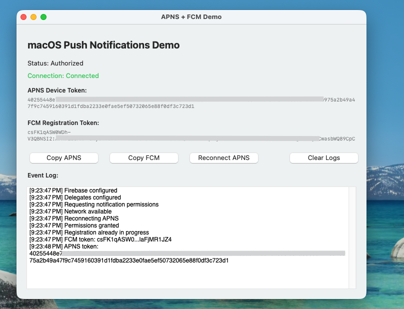

## APNS + FCM macOS demo

## Overview

This project demonstrates how to integrate **Apple Push Notification Service (APNS)** and **Firebase Cloud Messaging (FCM)** in a macOS application.

## Setup Instructions

1. **Create a New Bundle Identifier**

   * Go to your Apple Developer account and create a new **Bundle ID** for your macOS app.

2. **Enable Push Notifications**

   * In the Apple Developer portal, enable the **Push Notifications** capability for your new bundle ID.

3. **Configure and Download the APNS Certificate/Profile**

   * Create and download the **APNS certificate** or **profile** associated with your app.
   * Make sure to install it and configure it properly in your Xcode project.

4. **Update Project Configuration**

   * Replace the placeholder bundle identifier in the project settings with your newly created **Bundle ID**.
   * Update or replace the APNS profile/certificate in your project to match your configuration.

---

✅ **Tip:**
You can test notifications using Firebase Console or directly via **cURL** or **Postman** once both APNS and FCM are properly configured.

